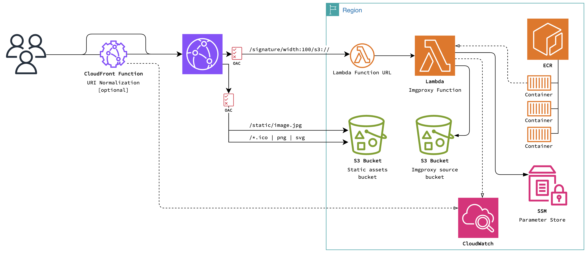

# Imgproxy with CloudFront distribution



## Prepare for Deployment

Before proceeding with deployment of the stack you will need to ensure the following:

- **Docker** is installed on your machine. You'll need it to push the imgproxy image to the ECR repository.

- The **AWS CLI** and **AWS CDK** are both installed and configured on your machine.

### Container image

You are going to deploy the latest build of the official Docker image of the OSS version of imgproxy: `ghcr.io/imgproxy/imgproxy:latest`. If you want to use a specific version of imgproxy, replace `'latest'` with the version tag.

If using a specific version of imgproxy, ensure it is version 3.22.0 or later. Docker images of versions earlier than this don't include the necessary AWS Lambda adapter.

The commands that follow assume that you have already created an ECR repository named `'imgproxy'` and are using place holders of `'us-east-1'` and `'123456789'` for AWS region and AWS account ID respectively. Be sure to replace each of these with the relevant values for your deployment before running the commands.

#### 1. Authenticate your Docker client with the ECR registry

Replace all instances of region (us-east-1) and account ID (123456789) with your actual region and account ID

```bash
aws ecr get-login-password --region us-east-1 | docker login --username AWS --password-stdin 123456789.dkr.ecr.us-east-1.amazonaws.com
```

#### 2. Pull the imgproxy Docker image

```bash
docker pull ghcr.io/imgproxy/imgproxy:latest-arm64
```

> [!NOTE]
> The Docker image tag is suffixed with `-arm64`. This is because we're going to run imgproxy on AWS Lambda with Graviton processors, and this suffix ensures that we're using an image built for ARM64 architecture.

#### 3. Tag the pulled Docker image for ECR

The AWS tag structure is as follows:`<account_id>.dkr.ecr.<region>.amazonaws.com/<ecr_repo_name>:<ecr_image_tag>`. Replace each of these with the relevant values for your deployment making sure that the ECR Repository name matches the ECR repository that exists in your account.

```bash
docker tag ghcr.io/imgproxy/imgproxy:latest-arm64 123456789.dkr.ecr.us-east-1.amazonaws.com/imgproxy:latest
```

> [!NOTE]
> The tag `:latest` is used here which matches the default configuration of the stack. If you use a different tag be sure to create a `.env` file and set `LAMBDA_ECR_REPOSITORY_TAG` to the same value (see: [Configuration](#configuration)).

#### 4. Push the tagged image to the ECR repository

The image tag you push here should match the one created in the prior command.

```bash
docker push 123456789.dkr.ecr.us-east-1.amazonaws.com/imgproxy:latest
```

</br>

These instructions have been adapted from the imgproxy blog post
[(Almost) free image processing with imgproxy and AWS Lambda](https://imgproxy.net/blog/almost-free-image-processing-with-imgproxy-and-aws-lambda/).

## Deploy the stack using AWS CDK

Before deploying ensure AWS CDK is installed and configured and that you are logged in to the account you expect to deploy to.

```bash
git clone https://github.com/pilchard/imgproxy-aws-cdk.git
cd imgproxy-aws-cdk
pnpm install
cdk bootstrap
cp .env.sample .env
cp .imgproxy.env.sample .imgproxy.env
pnpm run deploy
```

Follow the prompts in the terminal to complete deployment. After deployment a script will run to initialize imgproxy signing parameters and sync configuration values from `.imgproxy.env` to SSM Parameters accessible by the Lambda Function.

Successful deployment details will be output in the terminal including demo links for the sample images as well as stack outputs such as the domain of the CloudFront distribution and the name of the default S3 bucket.

## Configuration

#### Stack

To customize the deployment copy the `.env.sample` to `.env` and edit the settings as needed.

```bash
cp .env.sample .env
```

#### Imgproxy Lambda

To set SSM Parameters for the Imgproxy Lambda Function create an `imgrproxy.env` file at the root of your project (or copy the provided sample) and set the configuration as needed.

```bash
cp imgproxy.env.sample imgproxy.env
```

## Clean up resources

To remove cloud resources created for this solution, just execute the following command:

```
pnpm run destroy
```

## License

This library is licensed under the MIT-0 License. See the LICENSE file.
